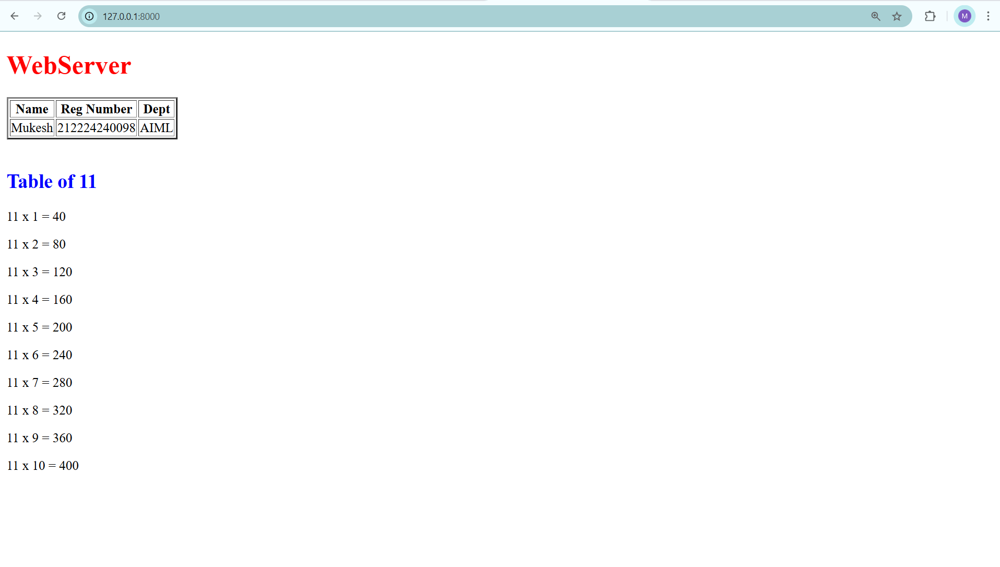

 
# EX01 Developing a Simple Webserver
## Date:

## AIM:
To develop a simple webserver to serve html pages and display the configuration details of laptop.

## DESIGN STEPS:
### Step 1: 
HTML content creation.

### Step 2:
Design of webserver workflow.

### Step 3:
Implementation using Python code.

### Step 4:
Serving the HTML pages.

### Step 5:
Testing the webserver.

## PROGRAM:
```html

<!DOCTYPE html>
<html lang="en">
<head>
    <meta charset="UTF-8">
    <meta name="viewport" content="width=device-width, initial-scale=1.0">
    <title> 40th table </title>
</head>
<body>
    <h1 style="color:red;" style="font-style: italic;"> WebServer</h1>

    <table border='2'>
       <tr>
           <th> Name</th>
           <th> Reg Number </th>
           <th> Dept </th>
       </tr> 
       <tr>
           <td> Mukesh </td>
           <td>212224240098</td>
           <td>AIML</td>
       </tr>
    </table>
       <br>   
    <h2 style="color:blue;"> Table of 11 </h2>
    <p>11 x 1 = 40</p>
    <p>11 x 2 = 80</p>
    <p>11 x 3 = 120</p>
    <p>11 x 4 = 160</p>
    <p>11 x 5 = 200</p>
    <p>11 x 6 = 240</p>
    <p>11 x 7 = 280</p>
    <p>11 x 8 = 320</p>
    <p>11 x 9 = 360</p>
    <p>11 x 10 = 400</p>


</body>
</html>
```


## OUTPUT:



## RESULT:
The program for implementing simple webserver is executed successfully.
